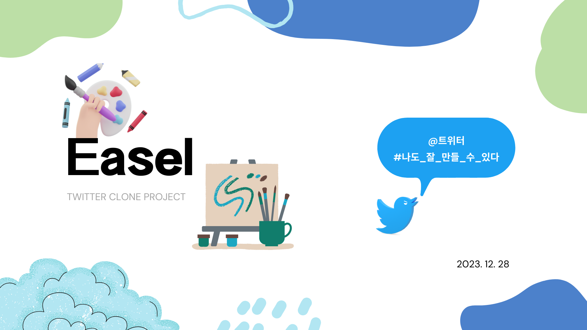

## Smilegate Server Devcamp 5th - Palette (2조)

## 🎨 Easel

실제 트위터 서비스의 기술 스택을 사용하여 구현된 K-Twitter 서비스입니다.

## 🚀 서비스 주요 기능 소개

**1. 트윗 작성**

    트윗을 작성하여 게시하고 싶은 내용을 담을 수 있습니다. 이미지, 동영상과 같은 정적 컨텐츠도 업로드 가능합니다.

**2. 타임라인 조회**

    각 사용자에게 추천되는 트윗을 조회할 수 있습니다. 또한 팔로우하고 있는 사용자의 트윗만 조회할 수도 있습니다.

**3. 재게시, 인용, 답글, 좋아요, 북마크**

    조회한 트윗에 대해 재게시, 인용, 답글을 남길 수 있고 좋아요(마음에 들어요), 북마크를 지정하여 해당 관계들로만 따로 모아볼 수 있습니다.

**4. 사용자 팔로잉**

    원하는 사용자를 팔로우 할 수 있습니다.

## 기술 스택

### [Frontend](https://github.com/sgdevcamp2023/palette/tree/main/src/web)

- React, TypeScript, Vite, react-error-boundary
- tailwindcss, Framer Motion.
- Tanstack Query, Tanstack Router
- Cloudinary
- Jest

### [Android](https://github.com/sgdevcamp2023/palette/tree/main/src/mobile)

- MVVM
- Android 13 SDK(minSdk 26, targetSdk 33, compileSdk 33)
- AGP 7.0.0 이상
- Dagger-Hilt
- ViewBinding
- Glide
- Navigation
- Retrofit2
- Gson
- okhttp3

### [Backend](https://github.com/sgdevcamp2023/palette/tree/main/src)

- Java
- Spring Boot, JPA
- Spring Cloud Gateway, Spring Cloud Netflix
- Kafka, gRPC
- Neo4j, MySQL, Redis, ElasticSearch

## 팀 소개

Palette는 개인의 색깔을 섞어서 필요한 팀 색깔을 만들기 위해 만들어졌습니다.

## 팀원 소개

<table>
    <tr align="center">
        <td><B>김도율(Server)</B></td>
        <td><B>김도현(Server)</B></td>
        <td><B>박희원(Mobile)</B></td>
        <td><B>이상민(Web)</B></td>
        <td><B>이원영(Server)</B></td>
    </tr>
    <tr align="center">
        <td>
            

        </td>
        <td>
            

        </td>
        <td>
            

        </td>
        <td>
            

        </td>
        <td>
            

        </td>
    </tr>
    <tr align="center">
        <td>
            <a href="https://github.com/doxxx93"><I>doxxx93</I></a>
        </td>
        <td>
            <a href="https://github.com/k-diger"><I>k-diger</I></a>
        </td>
        <td>
            <a href="https://github.com/HeewonP825"><I>HeewonP825</I></a>
        </td>
        <td>
            <a href="https://github.com/poiu694"><I>poiu694</I></a>
        </td>
        <td>
            <a href="https://github.com/210-reverof"><I>210-reverof</I></a>
        </td>
    </tr>
</table>

